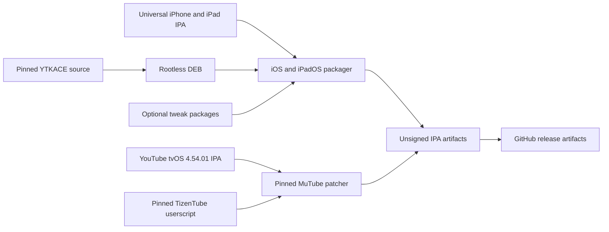

# MaxTube

MaxTube builds modified YouTube IPAs for iPhone, iPad, and Apple TV. The
iPhone/iPad path uses the open-source [YTKACE](https://github.com/itzzace/ytkace)
enhancer and optional standalone tweaks. The Apple TV path uses
[MuTube](https://github.com/Exaphis/mutube) with a pinned
[TizenTube](https://github.com/reisxd/TizenTube) userscript. MaxTube does not
contain or download a YouTube IPA; you must provide a decrypted IPA that you
are allowed to modify.

The previous cracked YTLite 5.2.2 binary has been removed. Its downloader is
incompatible with newer YouTube releases and causes the failure reported in
[issue #9](https://github.com/Mark02-2012/MaxTube/issues/9). YTKACE replaces the
opaque downloader with maintained source that includes SABR download handling,
cancellation, cleanup, and iPad presentation paths.

## Latest status

- iPhone and iPad packaging uses pinned YTKACE source and supports iOS/iPadOS
  15.0 or the YouTube base minimum when higher.
- Apple TV packaging is physically verified on Apple TV HD (`AppleTV5,3`)
  running tvOS 26.6. MuTube and TizenTube loaded successfully, including their
  ad-block and SponsorBlock configuration.
- `just install-tvos` provisions, signs, installs, and launches through Xcode's
  command-line tools; neither jailbreaking nor the Xcode application UI is
  required after an Apple account is configured once.
- **Publish multi-platform MaxTube release** builds any requested combination
  of iOS/iPadOS and tvOS IPAs, creates a unique Git tag, and publishes a GitHub
  release automatically.

## Platform support

| Platform | Status | Minimum version |
| --- | --- | --- |
| iOS | Build and packaging supported | 15.0, or the base YouTube IPA minimum when higher |
| iPadOS | Build and packaging supported | 15.0, or the base YouTube IPA minimum when higher |
| tvOS | Packaging supported for YouTube 4.54.01 | The base YouTube IPA minimum |

YTKACE declares an iOS 15.0 deployment target. The packaging script accepts
only an `iPhoneOS` base whose `UIDeviceFamily` contains both iPhone and iPad,
and raises a lower `MinimumOSVersion` to 15.0. This makes the output metadata
match the injected binary; it does not lower the YouTube base's own minimum.

tvOS uses a separate path because YTKACE is an iPhoneOS binary. MuTube patches
exact ARM64 offsets in the decrypted YouTube tvOS 4.54.01 executable, then
loads TizenTube 1.15.0 at runtime. Other YouTube versions are rejected instead
of receiving unsafe offset patches. The packager preserves the base app's
`MinimumOSVersion`; lowering metadata cannot make its executable support an
older tvOS runtime. It removes only the optional `UISupportedDevices` model
allowlist so the result can be signed for Apple TV HD as well as Apple TV 4K.

MuTube upstream reports testing on Apple TV 4K. This repository's package is
also verified on Apple TV HD: automatic provisioning, signing, installation,
launch, and the pinned TizenTube configuration all completed successfully.



## Local build and packaging

Prerequisites for iPhone and iPad:

- `just`, `actionlint`, Git, GNU Make, `dpkg-deb`, Python 3, `pipx`, `unzip`,
  and `zip`
- Theos with a compatible iPhoneOS SDK, exported as `THEOS`
- `cyan` from the pinned [pyzule-rw](https://github.com/asdfzxcvbn/pyzule-rw)
  revision used by CI
- `gh` only when publishing a draft release

From the repository root, build the pinned YTKACE package:

```sh
just build-enhancer
```

The package is written to `dist/ytkace.deb`. Package a universal iPhone/iPad
base IPA:

```sh
just package /path/to/YouTube.ipa dist/ytkace.deb
```

The IPA is written to `dist/MaxTube.ipa`. To include additional packages, call
the canonical script directly and append `.deb` or `.appex` paths:

```sh
scripts/package-ios.sh \
  /path/to/YouTube.ipa \
  dist/ytkace.deb \
  dist/MaxTube.ipa \
  /path/to/extra.deb
```

`APP_DISPLAY_NAME` and `APP_BUNDLE_ID` override the default app name and bundle
identifier. The generated IPA is not signed for your Apple account; your
sideloading tool performs that step.

For Apple TV, install `uv` and use a full Xcode installation with an AppleTVOS
SDK. Package a decrypted YouTube tvOS 4.54.01 IPA with the Xcode installed by
Xcodes:

```sh
DEVELOPER_DIR=/Applications/Xcode-27.0.0.app/Contents/Developer \
  just package-tvos /path/to/YouTube-tvOS-4.54.01.ipa
```

The output is `dist/MaxTube-tvOS.ipa`. It is unsigned and must be signed for
the Apple TV before installation. The build downloads only the pinned MuTube
source and Python dependencies; TizenTube itself is fetched by the app at
runtime from its pinned jsDelivr package version.

With a paid Apple Developer account configured in Xcode, provision, sign,
install, and launch the IPA without opening the Xcode application:

```sh
just install-tvos \
  dist/MaxTube-tvOS.ipa \
  dist/MaxTube-tvOS-signed.ipa
```

The command uses Xcode's CLI to register the paired Apple TV and refresh a
development profile, changes the app identifier to
`com.xsyetopz.maxtube.tvos`, signs nested code and the app, installs it with
`devicectl`, and launches it. `TVOS_TEAM_ID`, `TVOS_DEVICE_ID`, and
`TVOS_BUNDLE_ID` override the private-fork defaults.

The same command supports a free Apple Personal Team. Add the Apple account to
Xcode once, pair one physical Apple TV, and run the command. Free provisioning
expires after seven days, so rerun it weekly. See the complete
[installation guide](docs/INSTALL.md) for iPhone, iPad, Apple TV, paid teams,
free accounts, renewal, and troubleshooting.

The same draft publisher works for the tvOS artifact. Copy the tvOS release
template, replace its four placeholders, then publish:

```sh
cp .github/RELEASE_TEMPLATE/Release_Notes_tvOS.md dist/release-notes-tvOS.md
# Replace the four placeholders in dist/release-notes-tvOS.md.
just publish mutube-ce08072-youtube-4.54.01 \
  "MaxTube tvOS: MuTube ce08072 with YouTube 4.54.01" \
  dist/MaxTube-tvOS.ipa \
  dist/release-notes-tvOS.md
```

Publish an existing IPA and the repository's release notes as a draft:

```sh
cp .github/RELEASE_TEMPLATE/Release_Notes.md dist/release-notes.md
# Replace the two placeholders in dist/release-notes.md before publishing.
just publish ytkace-1.0.0-youtube-21.33.6 \
  "MaxTube: YTKACE 1.0.0 with YouTube 21.33.6" \
  dist/MaxTube.ipa \
  dist/release-notes.md
```

## GitHub Actions

### Automatic multi-platform releases

Run **Publish multi-platform MaxTube release** and provide an iPhone/iPad IPA
URL, a tvOS IPA URL, or both. The workflow packages the selected platforms,
creates a tag named `maxtube-<run>-<commit>`, and immediately publishes a
GitHub release containing the unsigned IPAs and third-party notices. Select
**prerelease** when the output should not become the latest stable release.

Base URLs are hidden from the log. Packaging jobs have read-only repository
access; only the final release job receives `contents: write`, and it does not
execute code from the generated IPAs. Released IPAs remain unsigned because
Apple profiles are specific to each account and device.

### Platform-specific workflows

Fork the repository, enable GitHub Actions, and run **Create MaxTube app**. Give
it a direct link to a universal decrypted YouTube IPA and select any optional
tweaks. The workflow:

1. builds the pinned YTKACE revision and selected tweak packages;
2. packages and validates the IPA in a read-only job;
3. uploads the exact package as a workflow artifact; and
4. creates a draft release in a separate write-scoped job.

The **Generate tweak packages** workflow publishes DEBs as a short-lived
workflow artifact. **Generate YTKACE Cyan and TrollFools packages** creates a
draft release containing the selected injection formats.

For Apple TV, run **Create MaxTube tvOS app** with a direct link to a decrypted
YouTube tvOS 4.54.01 IPA. Its read-only package job validates and patches the
base, uploads the result as a short-lived workflow artifact, and passes it to a
separate write-scoped job that creates a draft release.

## Updating pinned components

The repository, revision, and expected package version are defined once in
[`config/ytkace.env`](config/ytkace.env). Update all three together and run:

```sh
just check
```

The source revision is intentionally immutable so local and CI builds select
the same implementation. See [THIRD_PARTY_NOTICES.md](THIRD_PARTY_NOTICES.md)
for licensing and attribution.

MuTube's repository, revision, required YouTube version, and TizenTube package
version are defined in [`config/mutube.env`](config/mutube.env). MuTube has no
published license. This fork knowingly uses it for private builds; do not
assume that permits public redistribution.

## Disclaimer

This project is independent and is not affiliated with or endorsed by Google
LLC or YouTube. Product names and trademarks belong to their owners. Follow the
YouTube terms applicable to your account, content, and jurisdiction.
